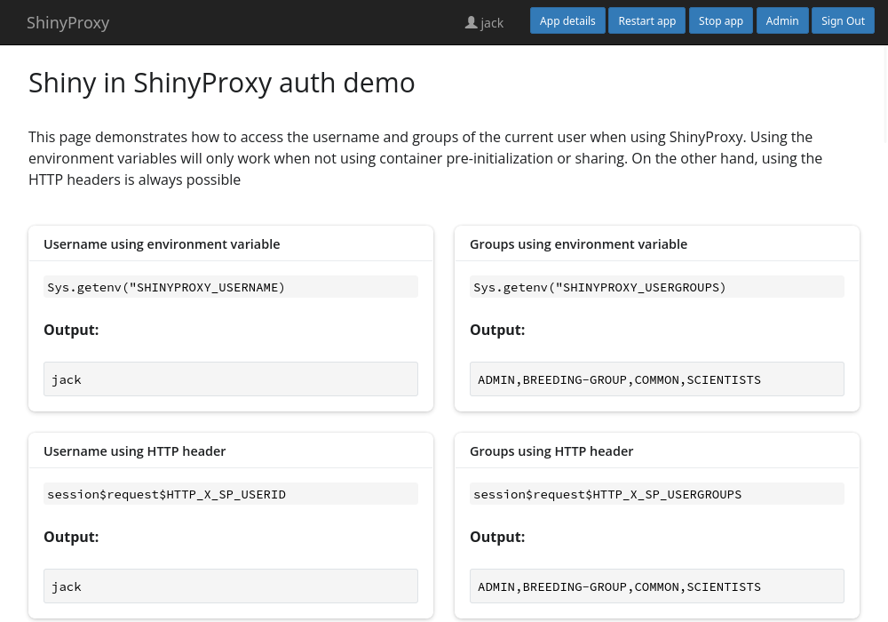

# ShinyProxy Template

This repository explains how to retrieve the username and group of the current
user when deploying a Shiny app using ShinyProxy. The corresponding app can be
run in ShinyProxy and shows the available values.



## Using environment variables

When ShinyProxy creates a container, it passes the username and groups to the
container using environment variables. This method is supported in all versions
of ShinyProxy. However, it does not work when using
[container pre-initialization and sharing](https://shinyproxy.io/documentation/configuration/#container-pre-initialization-and-sharing)
introduced in ShinyProxy 3.1.0.

Example code:

```R
Sys.getenv("SHINYPROXY_USERNAME")
Sys.getenv("SHINYPROXY_USERGROUPS")
```

See [`app.r`](example/app.r) for a complete example.

## Using HTTP headers

Starting with version 3.1.0, ShinyProxy adds the username (and groups) as HTTP
headers to every request sent to an app. This method is always supported, even
when
using [container pre-initialization and sharing](https://shinyproxy.io/documentation/configuration/#container-pre-initialization-and-sharing).

```R
session$request$HTTP_X_SP_USERID
session$request$HTTP_X_SP_USERGROUPS
```

See [`app.r`](example/app.r) for a complete example.

## Building the Docker image

To pull the image made in this repository from Docker Hub, use

```bash
sudo docker pull openanalytics/shinyproxy-shiny-demo-auth
```

The relevant Docker Hub repository can be found
at <https://hub.docker.com/r/openanalytics/shinyproxy-shiny-demo-auth>.

To build the image from the Dockerfile, navigate into the root directory of this
repository and run

```bash
sudo docker build -t openanalytics/shinyproxy-shiny-demo-auth .
```

Running the image for testing purposes outside ShinyProxy can be done using e.g.

```bash
sudo docker run -it -p 3838:3838 openanalytics/shinyproxy-shiny-demo-auth
```

## ShinyProxy Configuration

Create a ShinyProxy configuration file (see [application.yml](application.yml)
for a complete file), containing:

```yaml
proxy:
  specs:
    - id: shiny-auth
      container-image: openanalytics/shinyproxy-shiny-demo-auth
```

## References

- [ShinyProxy.io](https://shinyproxy.io/)
- [All demos](https://shinyproxy.io/documentation/demos/)

**(c) Copyright Open Analytics NV, 2024.**
